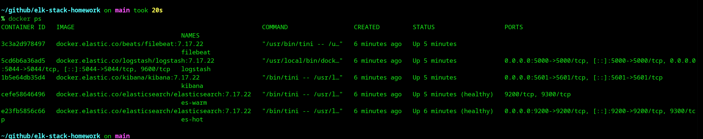
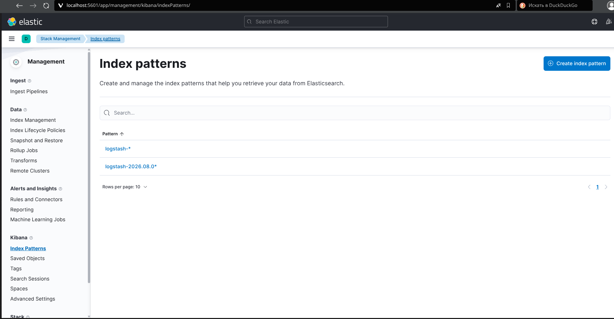
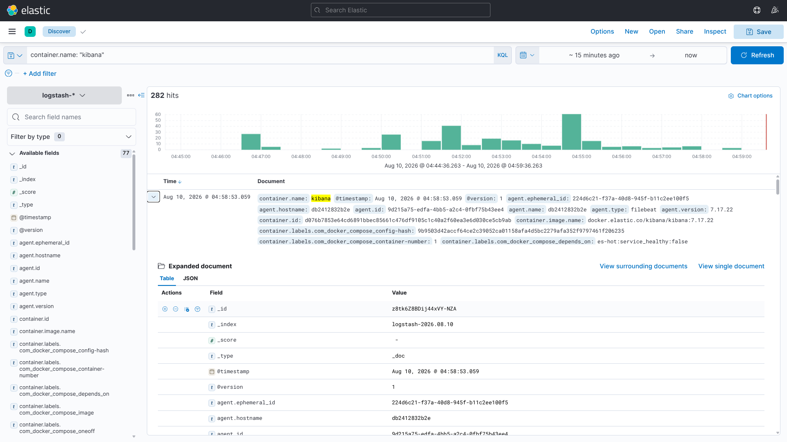

# "Система сбора логов Elastic Stack" - Шаров Олег

## Состав стека

В Docker подняты и связаны между собой 5 контейнеров:

- `es-hot` — Elasticsearch hot-нода;
- `es-warm` — Elasticsearch warm-нода;
- `logstash` — принимает JSON по TCP (порт 5000) и события beats (порт 5044);
- `kibana` — веб-интерфейс (порт 5601);
- `filebeat` — читает логи Docker и отправляет их в Logstash.

## Архитектура

```text
Логи Docker-контейнеров (/var/lib/docker/containers/*/*.log)
        ↓
Filebeat
        ↓ (beats, 5044)
Logstash (дополнительно принимает JSON по TCP, 5000)
        ↓
Elasticsearch (кластер elk-homework: es-hot + es-warm)
        ↓
Kibana (http://localhost:5601)
```

## Задание 1

### docker-compose манифест

```yaml
networks:
  elk:
    driver: bridge

volumes:
  es-hot-data:
  es-warm-data:
  filebeat-data:

services:
  es-hot:
    image: docker.elastic.co/elasticsearch/elasticsearch:7.17.22
    container_name: es-hot
    restart: unless-stopped
    environment:
      - node.name=es-hot
      - cluster.name=elk-homework
      - discovery.seed_hosts=es-hot,es-warm
      - cluster.initial_master_nodes=es-hot,es-warm
      - node.attr.box_type=hot
      - bootstrap.memory_lock=true
      - xpack.security.enabled=false
      - ES_JAVA_OPTS=-Xms512m -Xmx512m
    ulimits:
      memlock:
        soft: -1
        hard: -1
    volumes:
      - es-hot-data:/usr/share/elasticsearch/data
    networks:
      - elk
    ports:
      - "9200:9200"
    healthcheck:
      test: ["CMD-SHELL", "curl -s http://localhost:9200 | grep -q 'You Know, for Search' || exit 1"]
      interval: 10s
      timeout: 5s
      retries: 30
      start_period: 90s

  es-warm:
    image: docker.elastic.co/elasticsearch/elasticsearch:7.17.22
    container_name: es-warm
    restart: unless-stopped
    depends_on:
      es-hot:
        condition: service_healthy
    environment:
      - node.name=es-warm
      - cluster.name=elk-homework
      - discovery.seed_hosts=es-hot,es-warm
      - cluster.initial_master_nodes=es-hot,es-warm
      - node.attr.box_type=warm
      - bootstrap.memory_lock=true
      - xpack.security.enabled=false
      - ES_JAVA_OPTS=-Xms512m -Xmx512m
    ulimits:
      memlock:
        soft: -1
        hard: -1
    volumes:
      - es-warm-data:/usr/share/elasticsearch/data
    networks:
      - elk
    healthcheck:
      test: ["CMD-SHELL", "curl -s http://localhost:9200 | grep -q 'You Know, for Search' || exit 1"]
      interval: 10s
      timeout: 5s
      retries: 30
      start_period: 90s

  logstash:
    image: docker.elastic.co/logstash/logstash:7.17.22
    container_name: logstash
    restart: unless-stopped
    environment:
      - LS_JAVA_OPTS=-Xms256m -Xmx256m
    depends_on:
      es-hot:
        condition: service_healthy
    volumes:
      - ./logstash/pipeline/logstash.conf:/usr/share/logstash/pipeline/logstash.conf:ro
      - ./logstash/config/logstash.yml:/usr/share/logstash/config/logstash.yml:ro
    ports:
      - "5044:5044"
      - "5000:5000"
    networks:
      - elk

  kibana:
    image: docker.elastic.co/kibana/kibana:7.17.22
    container_name: kibana
    restart: unless-stopped
    environment:
      - NODE_OPTIONS=--max-old-space-size=256
    depends_on:
      es-hot:
        condition: service_healthy
    volumes:
      - ./kibana/config/kibana.yml:/usr/share/kibana/config/kibana.yml:ro
    ports:
      - "5601:5601"
    networks:
      - elk

  filebeat:
    image: docker.elastic.co/beats/filebeat:7.17.22
    container_name: filebeat
    restart: unless-stopped
    user: root
    command: filebeat -e -strict.perms=false
    depends_on:
      - logstash
    volumes:
      - ./filebeat/filebeat.yml:/usr/share/filebeat/filebeat.yml:ro
      - /var/lib/docker/containers:/var/lib/docker/containers:ro
      - /var/run/docker.sock:/var/run/docker.sock:ro
      - filebeat-data:/usr/share/filebeat/data
    networks:
      - elk
```

### Конфигурация Logstash

`logstash/pipeline/logstash.conf`:

```text
input {
  beats {
    port => 5044
  }

  tcp {
    port => 5000
    codec => json
  }
}

filter {
  mutate {
    add_field => {
      "pipeline" => "logstash"
    }
  }
}

output {
  elasticsearch {
    hosts => ["http://es-hot:9200"]
    index => "logstash-%{+YYYY.MM.dd}"
  }
}
```

`logstash/config/logstash.yml`:

```yaml
http.host: "0.0.0.0"
xpack.monitoring.enabled: false
pipeline.workers: 2
```

### Конфигурация Filebeat

`filebeat/filebeat.yml`:

```yaml
filebeat.inputs:
  - type: container
    paths:
      - /var/lib/docker/containers/*/*.log

processors:
  - add_docker_metadata: ~
  - add_host_metadata: ~
  - drop_event:
      when:
        equals:
          container.name: logstash

output.logstash:
  hosts: ["logstash:5044"]

logging.level: info
```

### Конфигурация Kibana

`kibana/config/kibana.yml`:

```yaml
server.host: "0.0.0.0"
server.name: kibana
elasticsearch.hosts: ["http://es-hot:9200"]
```

### Запуск

```bash
docker compose up -d
```

### docker ps через 5 минут после старта (5 контейнеров)



### Интерфейс Kibana


## Задание 2

### Index patterns

Создано два index pattern:

- `logstash-*` — видит все индексы logstash;
- `logstash-2026.08.0*` — видит только индексы за 6–8 августа.



### Просмотр логов в Discover

Поиск по логам в KQL, например `container.name: "kibana"`.



Примеры поиска:

```text
container.name: "kibana"
error
```

## Проблемы и их решение

1. **Петля обратной связи.** Изначально в Logstash был `output { stdout { codec => rubydebug } }`. Filebeat читал stdout контейнера logstash и отправлял события обратно в Logstash, который снова печатал их в stdout — количество событий росло лавинообразно, система перегружалась. Решение: убран `stdout` из output и добавлен `drop_event` для контейнера `logstash` в Filebeat.
2. **Нехватка памяти на хосте (7 ГБ).** Ограничены heap для Logstash (`LS_JAVA_OPTS=-Xms256m -Xmx256m`) и Kibana (`NODE_OPTIONS=--max-old-space-size=256`), уменьшено число воркеров Logstash (`pipeline.workers: 2`).
README_EOF
```
